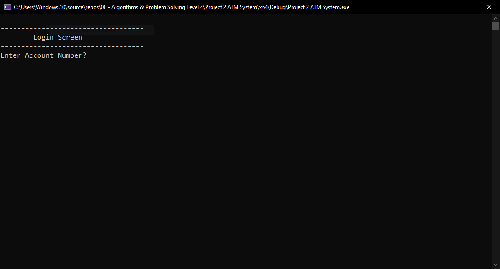
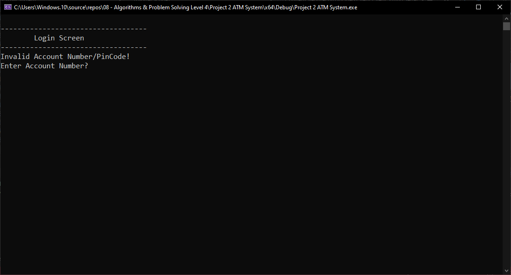
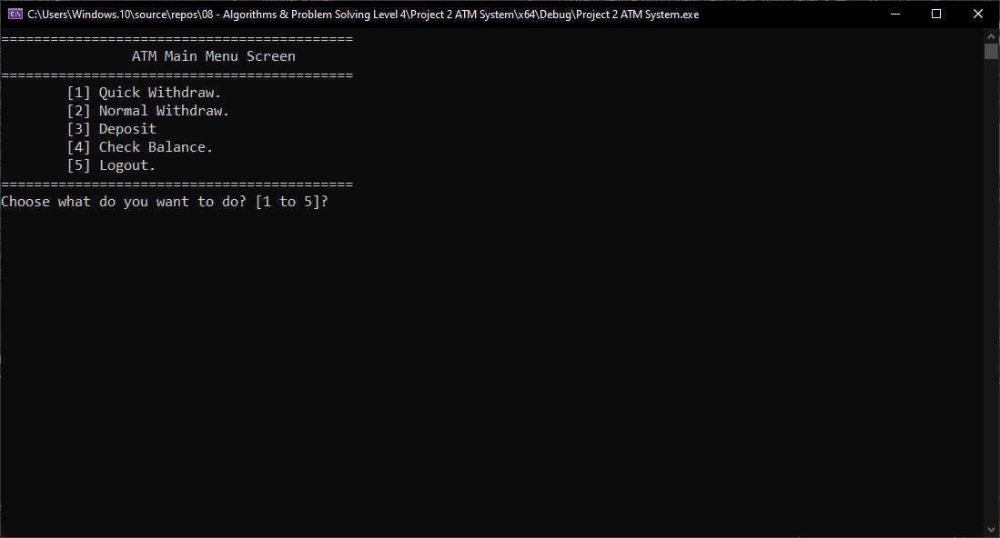
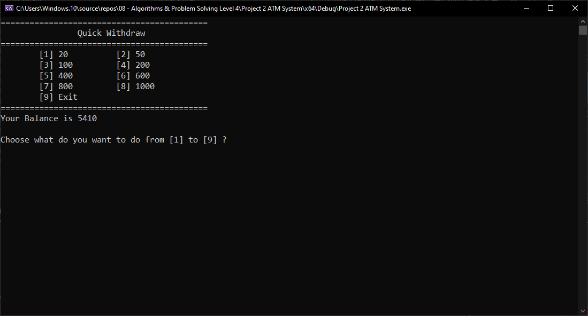
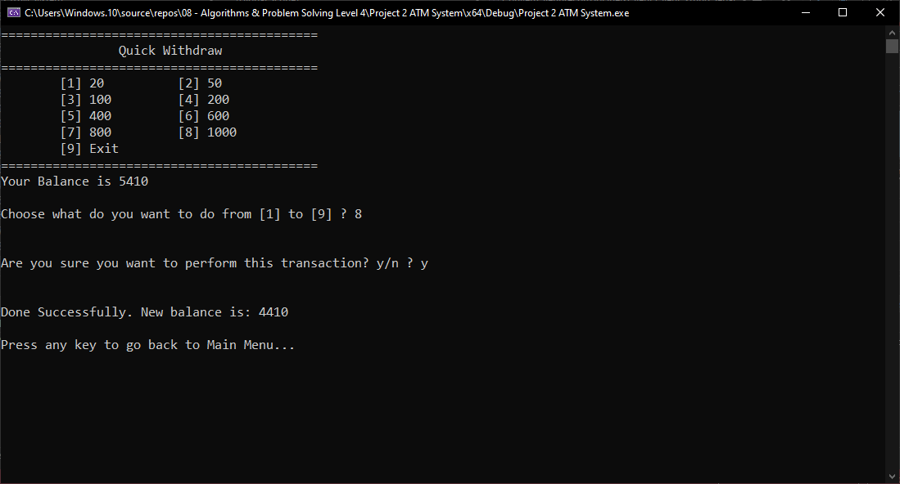
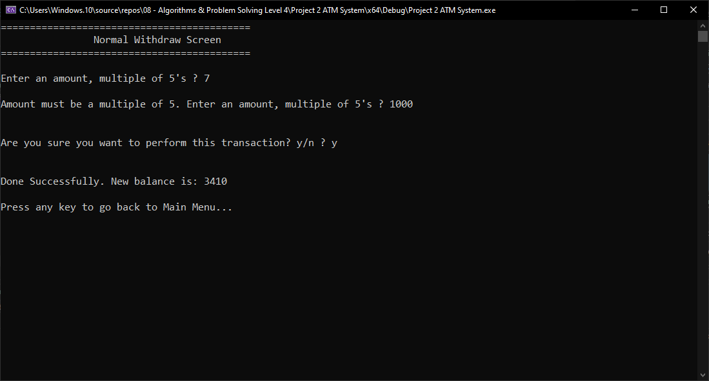
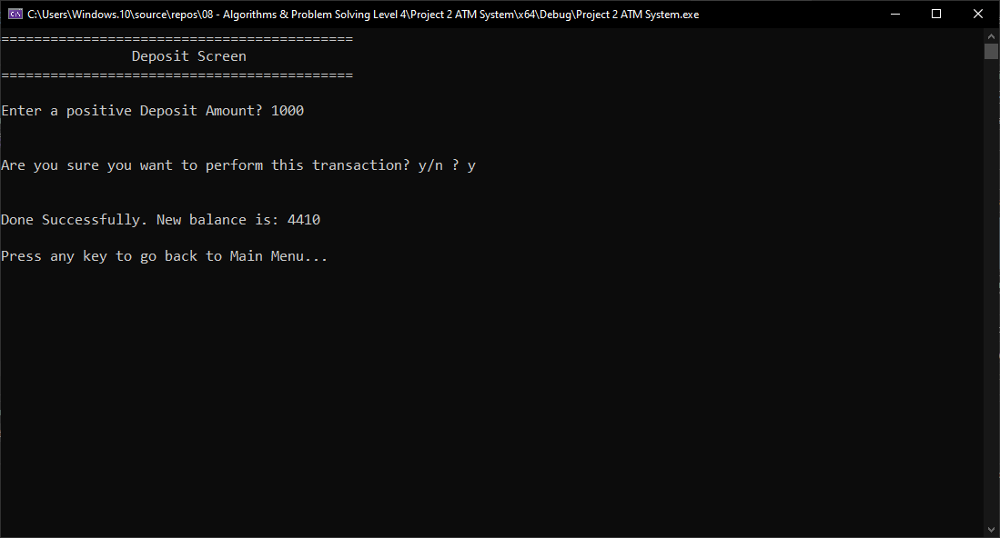
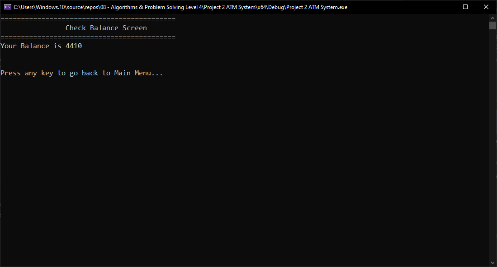

# ATM System

A console-based ATM simulation written in C++. This is a companion project to [Project Bank 1](https://github.com/Mahmoud-Amin-de/Project-Bank-1) — it reuses the same `Clients.txt` data file and the same `sClient` struct and file-handling functions, so a client created in Project Bank 1 can log in and transact here.

## Features

- **Login** — authenticate with Account Number + PIN Code (checked against `Clients.txt`)
- **Quick Withdraw** — pick from 8 preset amounts (20, 50, 100, 200, 400, 600, 800, 1000), with a balance check and confirmation before the transaction is applied
- **Normal Withdraw** — enter any custom amount that is a multiple of 5, with the same balance check and confirmation
- **Deposit** — enter any amount greater than 0 and add it to the account balance
- **Check Balance** — display the current account balance
- **Logout** — return to the login screen

## How it works

On start, the program shows the **Login Screen** and loops until a matching Account Number + PIN is found in `Clients.txt`. Once logged in, the matched client's data is kept in memory for the session and the **ATM Main Menu** is shown, offering the five options above.

Every transaction (withdraw or deposit) asks for a yes/no confirmation before it touches the account balance. Only after confirmation is the balance updated — both in memory and back to `Clients.txt` — so a declined transaction can never leave the session's balance out of sync with what's actually saved on disk.

## Architecture

The code is organized in the same three informal layers as Project Bank 1:

- **Data access** — `LoadClientsDataFromFile`, `SaveClientsDataToFile`, `SplitString`, and the line ⇄ record conversion functions, all shared with Project Bank 1's data format
- **Business logic** — `FindClientByAccountNumberAndPinCode`, `DepositBalanceToClientByAccountNumber`, and the input-validation helpers (`ReadAmountMultipleOfFive`, `ReadDepositAmount`, `ReadQuickWithdrawOption`)
- **Presentation** — the `Show...Screen` functions, which handle menus and user prompts and call into the layers above

Navigation is a recursive menu-driven state machine: each screen is a function, and moving to a different screen is a direct function call to it (e.g. confirming logout calls `ShowLoginScreen()` again).

## How data is stored

This project reads and writes `Clients.txt`, the same file used by Project Bank 1. The file is **not included in this repository** (see `.gitignore`) because it contains account balances and PIN codes in plain text. To run this project, either:

- copy over a `Clients.txt` created by Project Bank 1, or
- create one manually in the same format: `AccountNumber#//#PinCode#//#Name#//#Phone#//#AccountBalance`

## Screenshots

**Login Screen** — initial prompt for Account Number + PIN

**Invalid Login** — wrong Account Number/PIN, re-prompting

**ATM Main Menu** — the 5 options after a successful login

**Quick Withdraw** — the 8 preset amounts

**Quick Withdraw** — confirmation and updated balance

**Normal Withdraw** — rejecting a non-multiple-of-5, then succeeding

**Deposit** — confirmation and updated balance

**Check Balance** — current balance display

## Known limitations

- PIN codes are stored and compared in plain text — fine for a learning project, not for production
- Account balances are stored as `double`, which is not appropriate for real currency (rounding/precision issues)
- No automated tests — correctness was checked manually and by comparing against a reference solution
- Global `CurrentClient` state — a deliberate simplification for a single-user console app, not something that would scale to a multi-user system
- Screen navigation uses recursion with no depth limit; a very long session could theoretically hit a stack limit

## License

MIT — see [LICENSE](LICENSE).
